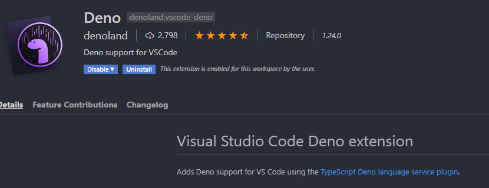
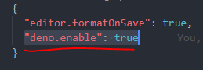

# try-deno

## Install

in Windows10

```shell
choco install deno
```

About other installations: [https://deno.land/#installation](https://deno.land/#installation)

## Start

```shell
deno run --allow-net ./src/server.ts
```

## VSCode extension

As Deno extension conflicts with `package.json`, you should install Deno, disable it and then `enable it only in this workspace`.

1. **Install:**
   
1. **Enable in .vscode/settings.json**

   
